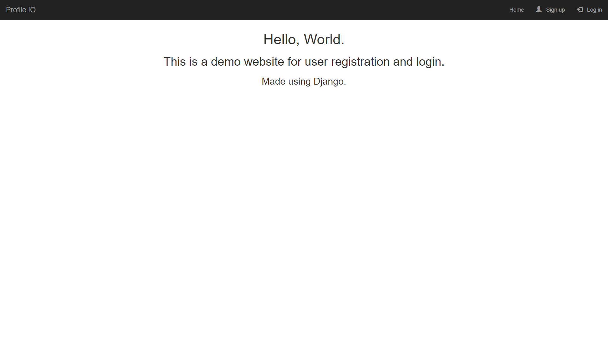
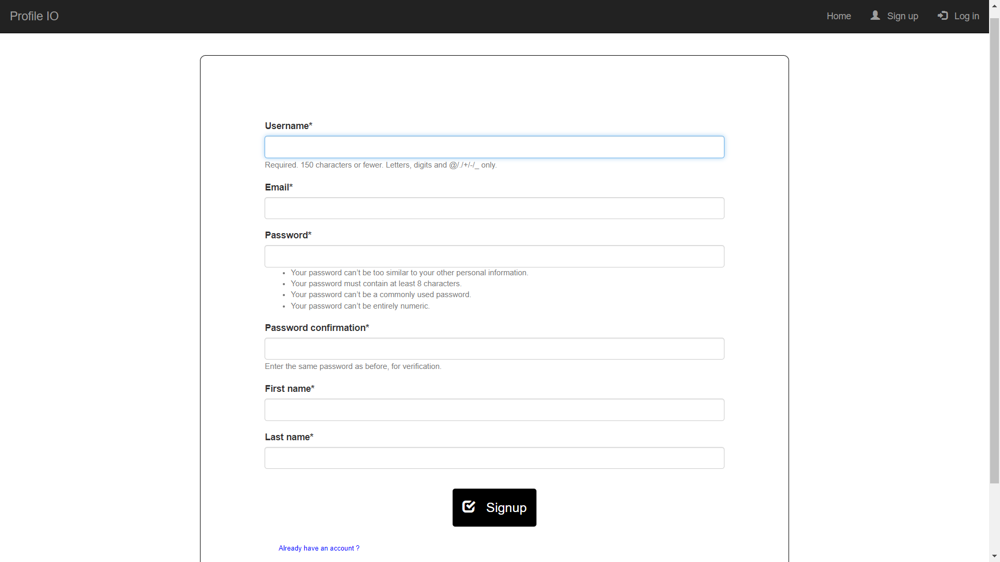
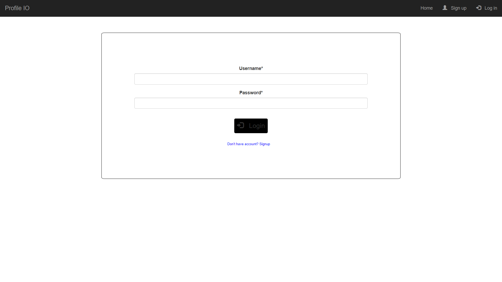
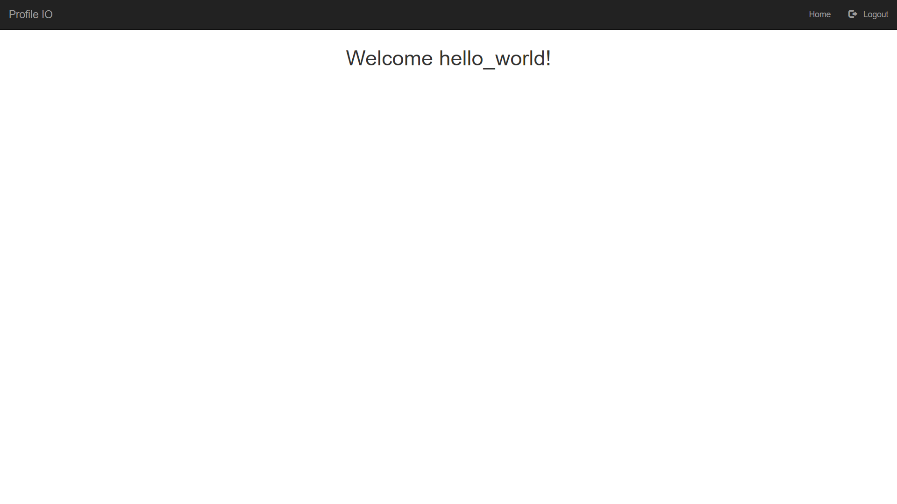

# Profile IO
A demo website made to register and login a user, built using django and bootstrap.

* Homepage of the website.


* Registration form


* Login Form


* Login Alert


* Welcome user page


* All the fields are validated on both client-side and server side.
* CDN links are used for CSS.

## Getting Started
* Create a virtual environment
* Installed required packages
```commandline
pip install requirements.txt
```
* Go to project folder
```commandline
cd profilio
```
* Run django server
```commandline
python manage.py runserver
```